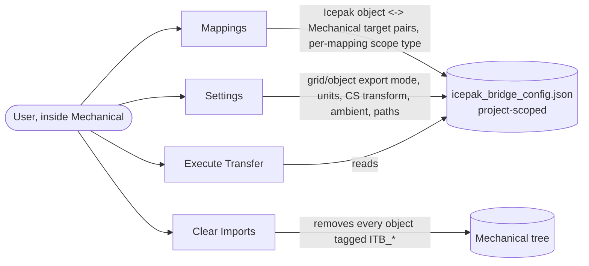
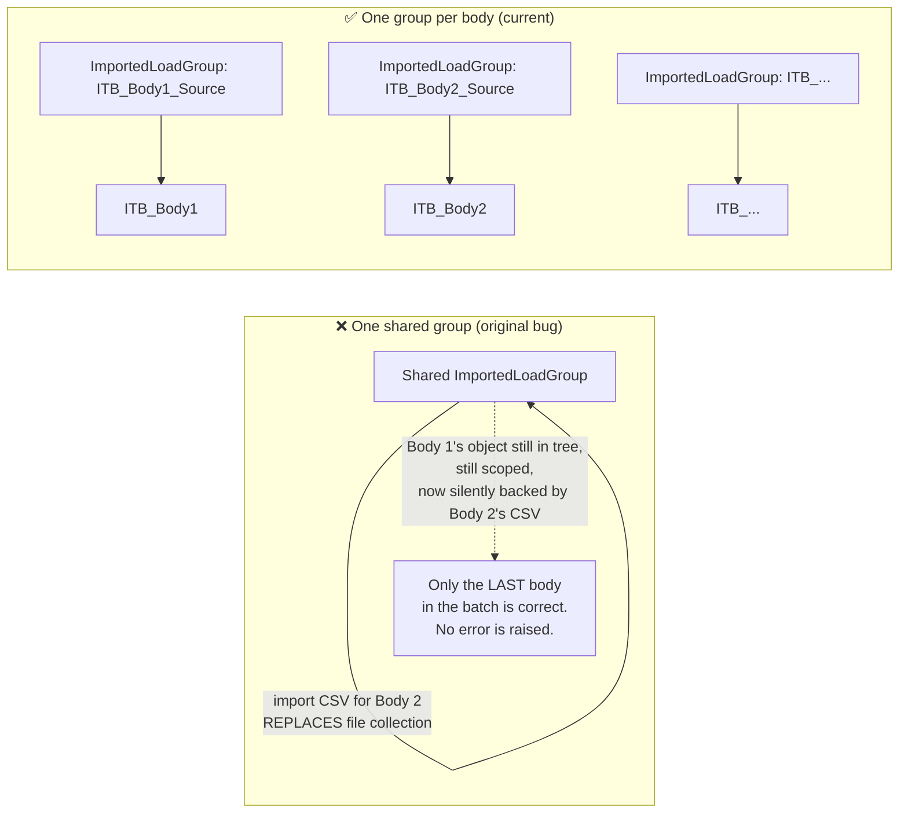
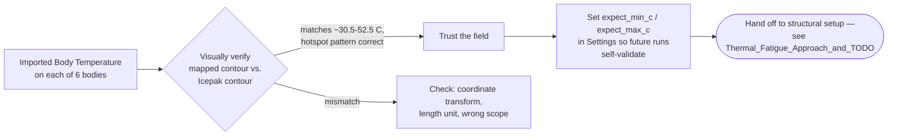

# IcepakThermalBridge — How the Program Works

> [!note] Files this maps to
> `main.py` (orchestrator + WinForms UI) · `icepak.py` (AEDT-side, batch mode) · `mechanical.py`/`bridge_mech.py` (Mechanical-side) · `settings.py` (config, units, coordinate transform) — all under `D:\Hare Karthik\Ansys\_ACT\IcepakThermalBridge\`.

## 1. Toolbar entry points

All configuration is one JSON file living beside the Mechanical solve files (`analysis.WorkingDir`), so it's project-scoped and travels with the project archive — no global/shared state between projects.

## 2. `Execute Transfer` — the main batch loop

This is the core of the tool. **One headless AEDT invocation handles discovery and every mapped object's export**, because each AEDT cold start costs a licence checkout and real wall-clock time — batching avoids paying that cost once per body.

```mermaid
flowchart TD
    Start([Execute Transfer clicked]) --> Load[Load config from JSON]
    Load --> Preflight{Pre-flight checks}

    Preflight -->|duplicate target body?| FailDup[Abort:<br/>one mapping per body only]
    Preflight -->|.aedt project locked by<br/>an interactive AEDT session?| FailLock[Abort:<br/>close the project in AEDT first]
    Preflight -->|OK| WorkDir[Resolve + create working directory<br/>default: project/IcepakBridge]

    WorkDir --> Discover{Discovery cache<br/>exists & valid?}
    Discover -->|no| RunDiscover[Headless AEDT run:<br/>ansysedt.exe -ng -RunScriptAndExit<br/>-> units, setups, solids, bounding boxes]
    Discover -->|yes| CacheHit[Load cached discovery JSON]
    RunDiscover --> HaveDiscovery[discovery data in memory]
    CacheHit --> HaveDiscovery

    HaveDiscovery --> SolveName[Build solution name<br/>e.g. Setup1 : SteadyState]
    SolveName --> BatchExport[Headless AEDT run #2:<br/>export EVERY mapped object in one script]

    BatchExport --> Method{export_method<br/>setting}
    Method -->|object, default| MeshExport[Fields Calculator export<br/>on the solid's own mesh<br/>-> no air points by construction]
    Method -->|grid, fallback| GridExport[ExportOnGrid over bounding box<br/>-> includes surrounding air]

    MeshExport --> Decimate[Cap point count<br/>max_source_points]
    GridExport --> AmbientFilter[Reject points within tolerance<br/>of configured ambient temp]

    Decimate --> FLD[".fld file per object"]
    AmbientFilter --> FLD

    FLD --> ParseFLD[Parse .fld<br/>detect temperature unit from header<br/>C / K / F]
    ParseFLD --> Stats[Compute FieldStats:<br/>min / max / mean / rejected counts]
    Stats --> CSV[Write CSV<br/>Steady: X,Y,Z,Temperature<br/>Transient: Time,X,Y,Z,Temperature]

    CSV --> Validate{CSV validation}
    Validate -->|too few points,<br/>out of physical range,<br/>or outside expected range| MarkFail[Mark this body FAILED<br/>continue to next body]
    Validate -->|pass| ToMech[Hand off to Mechanical side]

    ToMech --> Resolve{Resolve target body}
    Resolve -->|Named Selection match| ScopeNS[Scope via Named Selection]
    Resolve -->|no NS, body name match| ScopeName[Scope via body name]
    Resolve -->|no name, GeoBody ID match| ScopeID[Scope via GeoBody Id]
    Resolve -->|none match| MarkFail

    ScopeNS --> Group
    ScopeName --> Group
    ScopeID --> Group

    Group[Get-or-create ONE ImportedLoadGroup<br/>for THIS target body only] --> Replace{replace_existing?}
    Replace -->|yes| DeleteOld[Delete prior ITB_&lt;target&gt; object]
    Replace -->|no| Create
    DeleteOld --> Create[AddImportedBodyTemperature<br/>set Location = resolved scope]
    Create --> Import[.Import&#40;&#41; -> mapped field written<br/>onto the Mechanical body]
    Import --> MarkOK[Mark this body OK]

    MarkOK --> NextBody{More bodies<br/>in mapping list?}
    MarkFail --> NextBody
    NextBody -->|yes| BatchExport
    NextBody -->|no| Report[Summary dialog:<br/>N of M succeeded, per-body detail]

    FailDup --> End([End])
    FailLock --> End
    Report --> End
```

## 3. Why one `ImportedLoadGroup` per body (not one shared group)

## 4. Post-transfer — what the user still has to do manually

The tool's job ends when the CSV is mapped onto the Mechanical body as an `Imported Body Temperature` and the log reports PASS. Nothing after this point is automated yet:

## Key identifiers

`Execute Transfer` · `discovery cache` · `aedt_discovery.json` · `icepak_bridge_config.json` · `ImportedLoadGroup` · `ITB_ prefix` · `object mesh export` · `grid export fallback` · `FieldStats` · `ambient rejection` · `Named Selection scoping` · `GeoBody Id fallback` · `verify_import` · `mapped contour check`
