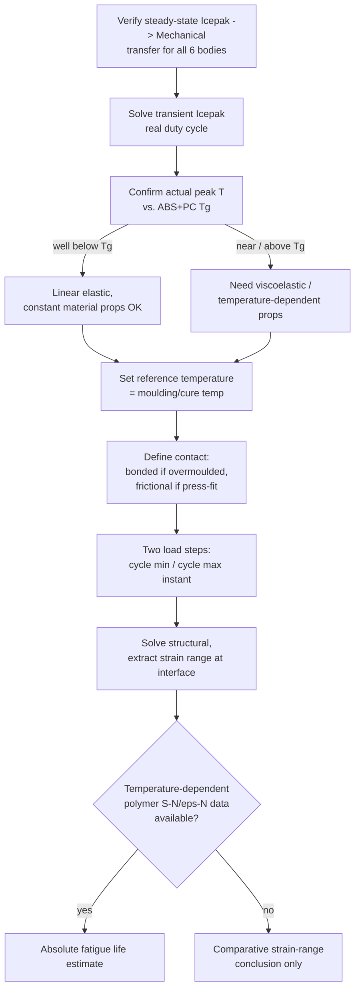

# Thermal Fatigue — Remaining Work & Approach

> [!important] Where this picks up from
> Everything in [[IcepakThermalBridge_Progress_Log]] gets a **steady-state temperature field** onto the Mechanical bodies. That is thermal *stress*, not thermal *fatigue* — one snapshot in, one stress state out. Fatigue needs a **cycle**. Nothing below has been built yet; this is the plan.

## 0. Immediate next step (before anything on this page)

Re-verify the batch-mode `IcepakThermalBridge` end-to-end for all 6 bodies inside the real project — see [[IcepakThermalBridge_Progress_Log]] §"Current status". Do not start on load steps or fatigue math against an unverified field mapping.

## 1. Transient Icepak solve

- Currently only a **steady-state** Icepak setup has been solved and transferred.
- Need a real Icepak **transient** setup driven by the actual electrical duty cycle (e.g. charge/discharge, or key-on/key-off), not a synthetic ramp.
- The tool's `transient_time_points` config already accepts a list of real solved time instants and will **refuse** to fabricate data (`allow_synthetic_transient` guard) — so this is an AEDT modelling task, not a tool-code task.
- Minimum useful set: the **cycle minimum** and **cycle maximum** temperature instants. More points only matter if the strain-vs-time path is non-monotonic between extremes.

## 2. Two-load-step Static Structural setup

- Not yet designed: does `IcepakThermalBridge` create both load steps automatically (assigning the cold-instant CSV to step 1, hot-instant CSV to step 2 on the same Imported Body Temperature object), or is this done manually in Mechanical after the tool populates each instant separately?
- Decide this once §1 exists — no point designing the Mechanical side against a transient field that hasn't been solved yet.

## 3. Reference (stress-free) temperature

- Must be set explicitly per body in Static Structural (Geometry → Reference Temperature, or Analysis Settings).
- **For an insert-moulded / overmoulded busbar-in-plastic assembly, this is the moulding/cure temperature — not ambient, and not the Icepak cold-instant temperature.** Get this wrong and the thermal strain calculation is off by the entire ΔT offset, silently.
- Needs a real number from the moulding process spec for the G-Bridge part, not an assumption.

## 4. Contact definition — busbar ↔ plastic interface

This is the location the fatigue is actually about, so the contact model matters more here than almost anywhere else in the model.

- **Overmoulded / insert-moulded:** bonded contact is defensible — the plastic was cast around the metal, there's no interface to slip.
- **Press-fit / snap-fit:** bonded contact **manufactures stress that doesn't physically exist**. Use frictional contact with a realistic μ for the actual material pair.
- Needs an engineering decision based on how this specific assembly is actually made — not assumed from the CAD alone.

## 5. Temperature-dependent material properties (E, CTE)

- Required for anything past a first-pass linear check. ABS+PC modulus and CTE are **not constant** with temperature, especially approaching the glass transition (Tg ≈ 110–125 °C for typical ABS+PC blends).
- Current known operating range from the steady-state solve is **30.5–52.5 °C** — well below Tg, so **linear elastic with constant properties is likely acceptable for now**, but this must be re-checked once the transient duty cycle (§1) is in and the actual peak temperature is known. If peaks approach Tg, linear elastic is no longer valid — see §7.
- Source: supplier datasheet (temperature-dependent E and CTE curves), or CAMPUS / Material Data Center if the exact grade is listed.

## 6. Strain extraction

- Once both load steps solve, extract **total mechanical strain range Δε** at the busbar–plastic interface — specifically at thin webs/ribs and interface corners, where CTE mismatch concentrates stress. Not a bulk/average value.
- This is the number the fatigue life calculation in §8 actually consumes.

## 7. Viscoelastic / creep consideration

- If the transient peak temperature (§1) turns out to sit near or above Tg, or if the housing experiences sustained load at elevated temperature (e.g. continuous high-current operation, not just transient spikes), **linear elastic is the wrong material model**.
- A busbar holder sitting at high temperature under sustained CTE-mismatch load will **relax** — stress relaxation changes the peak stress the part actually sees, often favourably, but this cannot be assumed without checking.
- Flag this as a decision point after §1's real duty-cycle peak temperature is known — do not pre-build viscoelastic material data speculatively.

## 8. Fatigue life estimate — the hardest open item

> [!warning] Ansys's built-in Fatigue Tool does not transfer to this problem
> The Mechanical Fatigue Tool's strain-life method uses **Coffin-Manson coefficients**, which are calibrated for **metals**. There is no direct route to plug ABS+PC into it and get a meaningful cycle count.

Options, in order of how defensible the result is:

1. **Best:** obtain supplier or literature **S-N or Δε–N curves for the specific ABS+PC grade at the relevant temperature**, and do the life calculation outside the built-in Fatigue Tool (custom post-processing reading strain range per load step, applied against the material's own curve).
2. **Fallback if no temperature-dependent polymer fatigue data exists:** treat the analysis as **comparative only** — design A vs design B strain range, not an absolute cycle count. State this limitation explicitly to whoever consumes the result; a comparative conclusion is still genuinely useful for a design decision, but must not be presented as an absolute life number.

## 9. Suggested execution order (once transient Icepak exists)

## Key identifiers

`thermal fatigue` · `CTE mismatch` · `reference temperature` · `stress-free temperature` · `insert-moulded` · `press-fit contact` · `ABS+PC` · `glass transition Tg` · `viscoelastic` · `creep` · `stress relaxation` · `Coffin-Manson` · `strain-life` · `S-N curve` · `Δε–N curve` · `comparative fatigue life` · `two load step` · `transient Icepak`
