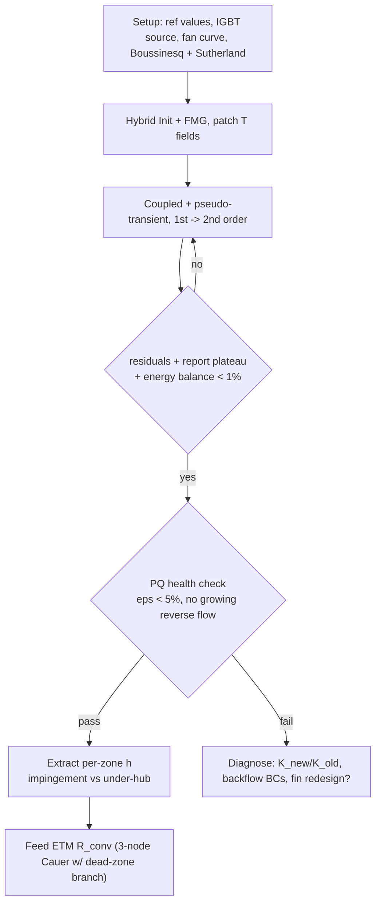
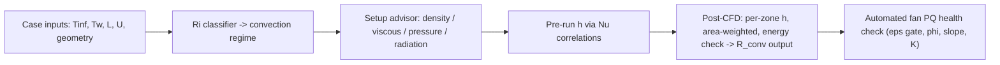

# CFD — Flowchart

## CHT solve + convergence gate

```mermaid
flowchart TD
    SET["Setup: ref values, IGBT source, fan curve, Boussinesq + Sutherland"] --> INIT["Hybrid Init + FMG, patch T fields"]
    INIT --> RUN["Coupled + pseudo-transient, 1st -> 2nd order"]
    RUN --> CONV{"residuals + report plateau<br/>+ energy balance < 1%"}
    CONV -->|yes| PQ{"PQ health check<br/>eps < 5%, no growing reverse flow"}
    CONV -->|no| RUN
    PQ -->|pass| H["Extract per-zone h<br/>impingement vs under-hub"]
    PQ -->|fail| DIAG["Diagnose: K_new/K_old, backflow BCs, fin redesign?"]
    H --> ETM["Feed ETM R_conv (3-node Cauer w/ dead-zone branch)"]
```

## Case configurator tool (Phase 2)

```mermaid
flowchart LR
    IN["Case inputs: Tinf, Tw, L, U, geometry"] --> RI["Ri classifier -> convection regime"]
    RI --> ADV["Setup advisor: density / viscous / pressure / radiation"]
    ADV --> PRE["Pre-run h via Nu correlations"]
    PRE --> POST["Post-CFD: per-zone h, area-weighted, energy check -> R_conv output"]
    POST --> GATE["Automated fan PQ health check (eps gate, phi, slope, K)"]
```

---
`CHT solve` · `convergence + PQ gate` · `zone-wise h` · `configurator tool`
