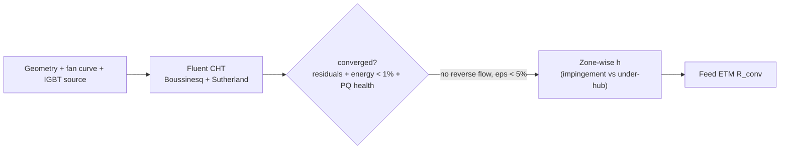

# CFD — Problem Statement

## Objective
A Fluent **conjugate heat transfer (CHT)** model of the MC heatsink under **mixed (forced + natural) convection**, to extract **dyno-validated zone-wise `h`** that feeds the [[ETM For Heatsink and IGBT/00 Home|ETM Cauer network]].

## Physics / logic chain

## System definition
MC heatsink with an impinging fan over straight fins; IGBT die as a volumetric energy source (`750 W / V_die`). Air modelled Boussinesq (buoyancy) + Sutherland (μ(T)). Mixed convection — the fan drives forced flow while buoyancy still matters at low flow.

## Scope
**In:** steady CHT baseline to convergence, PQ health / reverse-flow diagnosis, per-zone `h` extraction (impingement vs dead-zone kept separate), a CHT case configurator tool (Phase 2).
**Deferred:** transient CHT; full fin redesign (escalated to MC team only if still choked after convergence).

## Risks / invalidation triggers
- Trusting results before the fan **PQ health check** passes (`ε < 5 %`) — reverse flow at the fan exit invalidates the field. See [[Fan PQ Health Check & Reverse-Flow Diagnosis]].
- Averaging a single `h` across impingement and dead zones — they are different regimes: [[Dead-zone h is a different regime, not a correction factor]].
- Mesh `y+` not matched to the Yplus-for-HTC setting.

## Ideaverse concepts relied on
- [[Fan operating point = fan PQ curve ∩ system curve K·Q²]]
- [[Curve-match residual ε is a convergence gate for fan CHT]]
- [[Flow coefficient φ — below 0.35 expect central reverse flow]]
- [[Growing reverse-flow face count = physics-BC problem, not solver noise]]
- [[Impinging fan + straight tight fins = high cross-flow resistance]]
- [[Tighter fins raise system K → operating point shifts left toward stall]]
- [[Dead-zone h is a different regime, not a correction factor]]

---
`CHT` · `mixed convection` · `zone-wise h` · `PQ health gate` · `feeds ETM`
