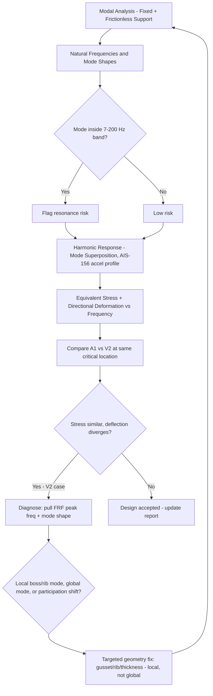

# CPP V2 — Flowchart

```mermaid
flowchart TD
    A[Modal Analysis - Fixed + Frictionless Support] --> B[Natural Frequencies and Mode Shapes]
    B --> C{Mode inside 7-200 Hz band?}
    C -->|Yes| D[Flag resonance risk]
    C -->|No| E[Low risk]
    D --> F[Harmonic Response - Mode Superposition, AIS-156 accel profile]
    E --> F
    F --> G[Equivalent Stress + Directional Deformation vs Frequency]
    G --> H[Compare A1 vs V2 at same critical location]
    H --> I{Stress similar, deflection diverges?}
    I -->|Yes - V2 case| J[Diagnose: pull FRF peak freq + mode shape]
    J --> K{Local boss/rib mode, global mode, or participation shift?}
    K --> L[Targeted geometry fix: gusset/rib/thickness - local, not global]
    L --> A
    I -->|No| M[Design accepted - update report]
```
