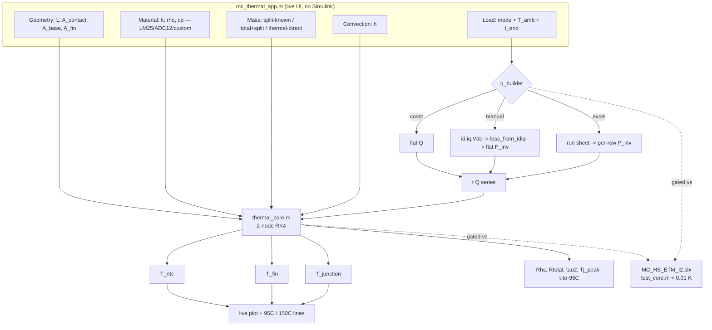

# 1D Thermal Design Tool — spec & flowchart

> Usage / handover / code walkthrough: [[1D Thermal Design Tool — README & usage]]

> Interactive MATLAB (`uifigure`) tool that predicts **T_ntc, T_junction, T_fin** for the T30 MC heatsink under a given heat load, so heatsink / alloy / fin changes are **screened fast in 1D** and CFD is reserved for shortlisted cases. This is the design-tool deliverable of the ETM project (Phase 2).

## Objective it answers
- Required base length **L** and thermal mass for a target temperature
- How **h** and **A_fin** trade off (design lever map)
- How a **fixed geometry** behaves for a given heat input over the 4-min duty

## Scope & honest flags
- **Heatsink only** (not generalised to G-Bridge yet). Validated envelope: 356–492 W, ≤300 s, 34–41 °C ambient, dyno airflow (MC fan, no ram air).
- **h is the only fitted parameter** (29.59; CFD area-weighted 34.3, 16 % apart). 1D **cannot predict h** for new fin geometry — h is an input, not computed.
- **+1.89 K NTC offset** not baked in (model ~2 K conservative). **No cooldown data** — C is CAD-derived. **T_junction estimated** — use `RthJC = 0.04167` for safety claims, `Tvj,op = 150 °C`.

## Architecture (one core, thin front-ends)
```
q_builder.m ──► [t Q] ──► thermal_core.m ──► T_ntc / T_fin / T_junction
   ▲                          ▲
   │ loss_from_idiq.m         │ geometry, material, mass, h
mc_thermal_app.m  ── live UI wrapping the above (NO Simulink in the loop)
```

## Data & control flow


## Phase gates (all passed)
| Phase | Deliverable | Gate | Status |
|---|---|---|---|
| 1 | `thermal_core.m` + `test_core.m` | RK4 vs closed-form < 0.01 K | ✅ 0.000 K |
| 2 | `loss_from_idiq.m` + `q_builder.m` | q_builder P_inv vs model < 1 W | ✅ 0.05 W |
| 3 | `mc_thermal_app.m` skeleton | app T = core T; live plot | ✅ |
| 4 | full inputs + Q modes + readouts | all 3 Q modes render live | ✅ |
| 5 | L-sweep | optimum L marked | ✅ 17.9 mm |
| 6 | h–A map | Tj contour; current point marked | ✅ |

## Why a fast twin (and the guard)
`MC_HS_ETM_I2.slx` stays the authoritative validation reference (Simscape, slow). `thermal_core` is its fast twin — that is what makes live sliders possible. **Two copies of the physics now exist**, so `test_core.m` locks them together; re-run it after ANY physics change to either side. This is the deliberate mitigation for the "don't fork the validation" guardrail.

## MATLAB files
`thermal_core.m` · `loss_from_idiq.m` · `q_builder.m` · `mc_thermal_app.m` · `test_core.m` · `test_app_gate.m` — all on the path with `MC_HS_ETM_I2.slx`. External working copy: `D:\Hare Karthik\Electrical\MC\MC_ETM_Model\`.

---
`1D thermal tool` · `thermal_core fast twin` · `gated to Simulink` · `L-sweep` · `h–A map` · `h is an input`
