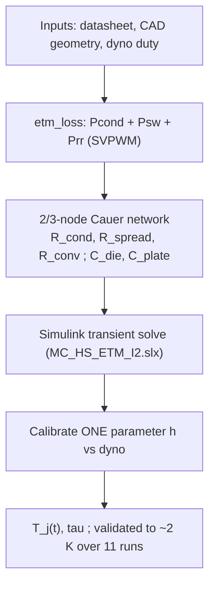
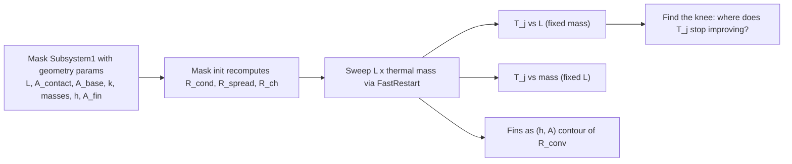

# ETM — Flowchart

## Model pipeline

```mermaid
flowchart TD
    IN["Inputs: datasheet, CAD geometry, dyno duty"] --> LOSS["etm_loss: Pcond + Psw + Prr (SVPWM)"]
    LOSS --> NET["2/3-node Cauer network<br/>R_cond, R_spread, R_conv ; C_die, C_plate"]
    NET --> SIM["Simulink transient solve (MC_HS_ETM_I2.slx)"]
    SIM --> CAL["Calibrate ONE parameter h vs dyno"]
    CAL --> OUT["T_j(t), tau ; validated to ~2 K over 11 runs"]
```

## Parametric-tool flow (Phase 2)

```mermaid
flowchart LR
    M["Mask Subsystem1 with geometry params<br/>L, A_contact, A_base, k, masses, h, A_fin"] --> R["Mask init recomputes R_cond, R_spread, R_ch"]
    R --> SW["Sweep L x thermal mass via FastRestart"]
    SW --> P1["T_j vs L (fixed mass)"]
    SW --> P2["T_j vs mass (fixed L)"]
    SW --> P3["Fins as (h, A) contour of R_conv"]
    P1 --> K["Find the knee: where does T_j stop improving?"]
```

---
`Cauer pipeline` · `Simulink mask` · `FastRestart sweep` · `(h,A) contour`
