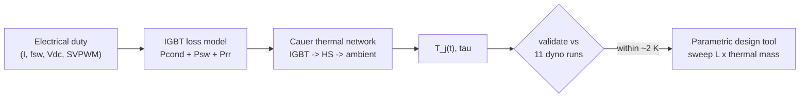

# ETM — Problem Statement

## Objective
A dyno-validated **1D electro-thermal (Cauer) model** of the IGBT + heatsink that predicts junction temperature from electrical duty, then a **design tool** that sweeps baseplate thickness `L` and thermal mass to find where `T_j` stops improving.

## Physics / logic chain

## System definition
IGBT module (FS200R07PE4 class) on the MC heatsink, air-cooled. Loss source at the die; conduction through die → baseplate → fin base; convection off the fins to ambient. Modelled as a lumped Cauer RC network, one fitted convective coefficient `h`.

## Scope
**In:** transient 1D model (≤ ~300 s validity), single fitted `h`, parametric sweep over `L` and thermal mass, fin study as an `(h, A)` contour of `R_conv`.
**Deferred:** steady-state extrapolation beyond the transient window; 3D conduction; any parallel MATLAB reimplementation (would fork the validation).

## Risks / invalidation triggers
- Bending a *derived* resistance to close the +1.89 K bias — forbidden; only `h` is fitted.
- Using the model past its ~300 s transient validity window.
- Reintroducing spreading error if `L` changes without recomputing `R_spread`.

## Ideaverse concepts relied on
- [[Cauer Model Calibration — fit what you cannot derive]]
- [[Spreading resistance — heat enters over the source, not the whole base]]
- [[Multi-node thermal time constants need eigenvalues, not per-branch RC]]
- [[Convection dominates the thermal budget]]
- [[Only the h·A product matters for convective resistance]]
- [[R = ΔT over Q holds only at steady state]]

---
`ETM` · `Cauer` · `T_j` · `single fitted h` · `parametric L x thermal mass`
