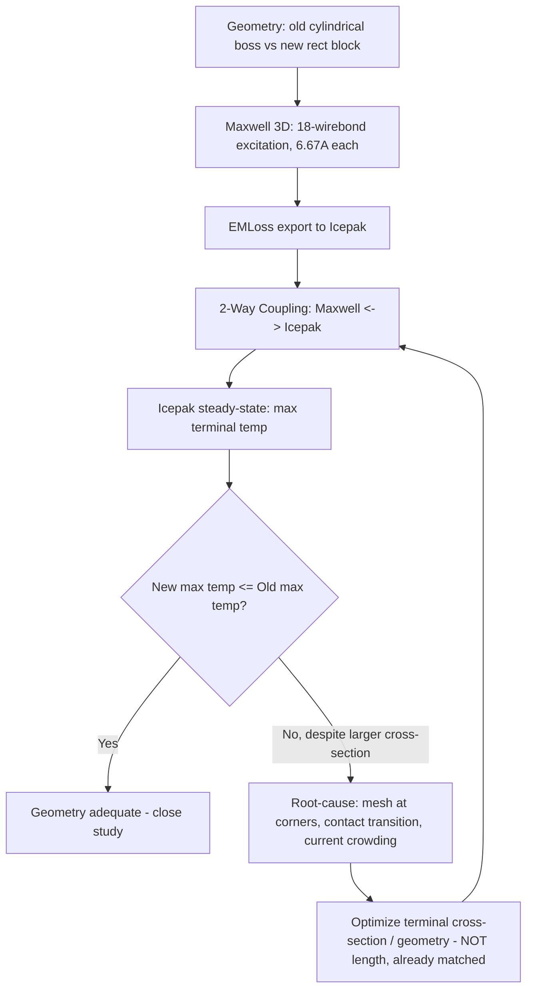

# Flowchart — Small Top Busbar ETM

```mermaid
flowchart TD
    A[Geometry: old cylindrical boss vs new rect block] --> B[Maxwell 3D: 18-wirebond excitation, 6.67A each]
    B --> C[EMLoss export to Icepak]
    C --> D[2-Way Coupling: Maxwell <-> Icepak]
    D --> E[Icepak steady-state: max terminal temp]
    E --> F{New max temp <= Old max temp?}
    F -->|Yes| G[Geometry adequate - close study]
    F -->|No, despite larger cross-section| H[Root-cause: mesh at corners, contact transition, current crowding]
    H --> I[Optimize terminal cross-section / geometry - NOT length, already matched]
    I --> D
```

**Current status:** New design through E (solved, 27°C ambient). Old design needs re-run at same 27°C before F can be evaluated.
