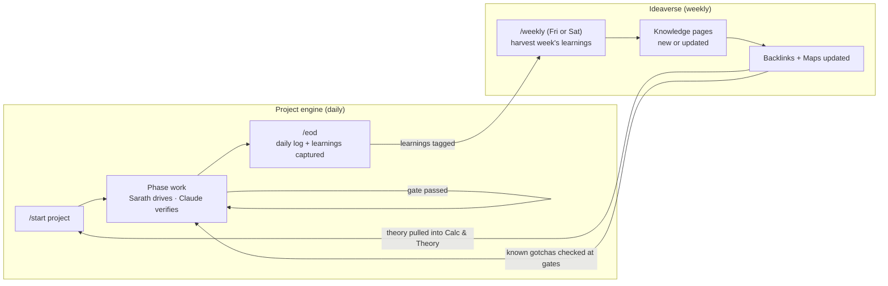

# K-OS Operating Brief — Vault Structure & Working Method

> [!abstract] For Claude Code
> This note defines how Sarath's engineering projects run and how the K-OS Obsidian vault is structured to match. K-OS has **two halves**: the **project engine** (doing the task) and the **Ideaverse** (the knowledge the tasks produce). Every task consumes theory, and every task gives theory back. Restructure the vault to this layout, align the templates, and keep it consistent as new projects arrive.

---

## 1. The working method

Two loops run together.



**Project engine (daily)**
- **`/start [project]`**: kicks off with the 6-section template and produces the four starter notes. **Before writing section 4 (Calc & Theory), search the Ideaverse** and link every existing knowledge page that applies. New projects start from what we already know.
- **Divide & conquer**: one phase per turn. Sarath drives in the software, Claude verifies. No phase advances until its gate passes.
- **`/eod`**: the day compiles into a dated daily log, including a **Learnings & theory** section: the concepts used, what was learned, and any gotchas hit. That section is the raw feed for the Ideaverse.
- **Honesty over polish**: every claim is tagged verified / assumed / needs-checking.

**Ideaverse (weekly)**
- **`/weekly`** (Friday or Saturday): harvest every `#learning` item from the week's EODs across all projects. Convert each one into a knowledge page, either as a new page or merged into an existing page. Then update the backlinks and domain maps.
- **Reuse**: knowledge pages feed `/start`, the phase gates, and the troubleshooting on future projects.

## 2. Target vault structure

```
K-OS/
├── _templates/
│   ├── Universal_Project_Workflow_Template.md   (blank 6-section kickoff)
│   ├── CAE_CFD_Project_Preset.md                (6-section + simulation spine pre-filled)
│   ├── Project_Note_Set_Template.md             (the four starter notes, blank)
│   ├── Daily_EOD_Template.md                    (the /eod log structure)
│   ├── Weekly_Review_Template.md                (the /weekly harvest structure)
│   └── Knowledge_Page_Template.md               (one concept per page)
│
├── projects/
│   └── <Project-Name>/
│       ├── <Project>_Problem_Statement.md
│       ├── <Project>_Progress_Log.md
│       ├── <Project>_Flowchart.md
│       ├── <Project>_Approach_and_TODO.md
│       └── daily/
│           └── EOD_<date>_<Project>_<phase>.md
│
├── ideaverse/
│   ├── maps/                (domain MOCs: Heat_Transfer, FEA, CFD, Electromagnetics,
│   │                         Fatigue, Materials, Numerical_Methods, Embedded_SW, Cloud …)
│   ├── concepts/            (atomic knowledge pages: one concept, principle, or method each)
│   ├── gotchas/             (failure modes and bugs turned into rules, e.g. unit mismatch)
│   └── weekly/
│       └── W<nn>_<YYYY-MM-DD>_Review.md
│
├── reference/               (textbooks, papers, standards, datasheets — the cited set)
│
└── index/
    ├── Home_MOC.md          (projects + active phase + latest EOD; Ideaverse maps entry)
    └── Knowledge_Backlog.md (learnings flagged but not yet promoted)
```

**Restructure actions for Claude Code:**
1. Create `_templates/`, `projects/`, `ideaverse/` (with `maps/`, `concepts/`, `gotchas/`, `weekly/`), `reference/`, and `index/` if they are not present.
2. Move each project's notes under `projects/<Project-Name>/` with the four-note naming. Collect daily logs into `daily/`.
3. **Backfill the Ideaverse.** Scan existing EODs, Progress Logs, and any learnings notes (for example the T30 MC thermal learnings) for concepts and gotchas. Create a knowledge page for each one and link it back to its source.
4. Create one domain map per domain present, linking all its concept pages.
5. Build `Home_MOC.md`. It is the "where we are" dashboard for projects, and it also serves as the entry point into the Ideaverse maps.

## 3. The four starter notes (every project has exactly these)

| Note | Holds |
|---|---|
| `Problem_Statement` | Objective, physics/logic chain (mermaid), system definition, scope (in vs. deferred), risks. **Links the Ideaverse concepts it relies on.** |
| `Progress_Log` | Chronological record of what was tried, what broke, the root cause, and the fix. A root cause that generalises gets flagged `#learning`. |
| `Flowchart` | How the process or custom tool actually works, as mermaid diagrams |
| `Approach_and_TODO` | Forward work in priority order, with the method and theory for upcoming phases (linked to concept pages) |

## 4. The 6-section kickoff template (drives Problem_Statement)

1. **Objective**: the deliverable (one line), its consumer and the decision it feeds, success criterion, scope boundary, risks
2. **Methodology**: the input → transform → output chain (mermaid), divided into verifiable phases with gates
3. **Software & Environment**: solvers, custom scripts and paths, hardware, launch quirks, file locations
4. **Calc & Theory**: **start from the Ideaverse.** List the linked concept pages first. Then add the governing relations, assumptions and validity window, invalidation triggers, data needed, and references. Mark any theory not yet in the Ideaverse as `#learning` so it gets harvested.
5. **End Result & how it's studied**: primary quantity, where it is read, verification gate, sensitivity and error drivers. **Check the relevant `gotchas/` pages at each gate.**
6. **End Result For**: consumer, format, absolute-vs-comparative honesty, next action unblocked

## 5. Daily EOD note structure (fixed)

YAML frontmatter (tags, date, objective, phase, related wikilinks) + sections:

`What we set out to do` → `What we actually did` → `Results & numbers` → `Decisions made and why` → **`Learnings & theory`** → `Blocked & open` → `Next session starts with` → `For Claude Code` → `Vault links`

**`Learnings & theory` section format.** Each item is one line, tagged so `/weekly` can find it:

```markdown
- #learning/concept — Contact conductance dominates busbar-to-TIM ΔT at low clamp pressure → [[Thermal_Contact_Resistance]]
- #learning/gotcha — CSV in mm imported as m gives 1000× geometry; always assert coordinate magnitude → new
- #learning/method — Singularity check: refine locally 2×; a real concentration converges, a singularity keeps rising → [[Stress_Singularity_vs_Concentration]]
```

Link an existing page if one exists. Otherwise write `→ new`.

## 6. Weekly knowledge synthesis — `/weekly` (Friday or Saturday)

**Input:** every `#learning` line from that week's EODs and Progress Logs, across all projects.

**Procedure for Claude Code:**
1. **Harvest**: collect all `#learning` items for the week and group them by concept.
2. **Dedupe against the Ideaverse**: if a page exists, **update it** by adding the new evidence, a new "where used" backlink, and any refined validity window. Never create a duplicate.
3. **Promote**: create new pages from `Knowledge_Page_Template.md`. Gotchas go in `gotchas/`; everything else goes in `concepts/`.
4. **Link**: add the page to its domain map(s), link related concepts to each other, and backlink to the source EODs and projects.
5. **Mature**: bump page status (see §7) when a concept has now been applied across two or more projects or validated against data.
6. **Backlog**: items too thin to promote go to `index/Knowledge_Backlog.md`. They are reviewed next week.
7. **Write the weekly review note** in `ideaverse/weekly/`.

**Weekly review note sections:**
`Week & projects touched` → `Pages created` → `Pages updated` → `Gotchas added` → `Backlog carried` → `Cross-project connections spotted` → `Theory to study next` → `For Claude Code`

## 7. Knowledge page template (`Knowledge_Page_Template.md`)

Frontmatter: `tags` (domain), `aliases`, `status: seedling | budding | evergreen`, `domain`, `related`, `sources`

Sections:
1. **One-line idea**: the concept in a single sentence
2. **Intuition first**: what's physically or logically happening, before any equations
3. **Governing relations**: equations and symbols with units
4. **Worked example**: real numbers from our work, **with the intermediate arithmetic shown**
5. **Validity window & invalidation triggers**: when this holds and when it breaks
6. **How we verify it**: the check or gate it supports
7. **Gotchas**: links to `gotchas/` pages
8. **Where used**: backlinks to projects, phases, and EODs (auto-grows each week)
9. **References**: links into `reference/`
10. Key identifiers line

**Status meaning:**
- **seedling**: seen once, from a single source
- **budding**: applied in a project and verified at a gate
- **evergreen**: used across two or more projects, or validated against test or benchmark data. Safe to reuse without re-deriving.

## 8. CAE/CFD preset (sections 4 & 5 pre-filled for simulation projects)

**Section 4 spine** (each item links to its Ideaverse page, which is backfilled if missing):
- Governing equations named: Navier-Stokes + turbulence model, the heat equation, or linear elasticity
- Material properties with their validity window (temperature-dependent, or is constant OK?)
- Boundary conditions with justification
- Assumptions with invalidation triggers: steady vs. transient, linear vs. nonlinear, Tg, yield

**Section 5 spine** (the CAE verification checklist — each item links to its `concepts/` or `gotchas/` page):
- Mesh independence
- Singularity vs. real concentration at every hotspot
- Physical-location sanity
- Magnitude sanity
- Validation against a known result: benchmark, test data, analytical solution, or prior run
- **Unit and data-transfer sanity**: coordinate and field magnitudes survive every tool handoff

## 9. Vault conventions

- YAML frontmatter on every note (tags, aliases, status, related)
- Wikilinks between the four project notes, **and from projects to Ideaverse pages in both directions**
- One concept per knowledge page. Link to other pages; don't nest one concept inside another.
- Mermaid for any flow, process, or architecture
- Obsidian callouts (`> [!note]`, `> [!warning]`, `> [!abstract]`, `> [!tip]` for intuition)
- A key-identifiers line at the foot of major notes and every knowledge page
- Match Sarath's style: casual, action-first, intuition before equations, worked examples with the intermediate arithmetic shown

## 10. Standing tasks for Claude Code

- **IcepakThermalBridge**: add an automatic m/mm sanity assert to the import step. It should compare the CSV coordinate magnitude against the declared length unit and warn on a ~1000× mismatch.
- **Ideaverse seed from that bug**: create `gotchas/Unit_Mismatch_in_CAE_Data_Transfer.md` (where used: G-Bridge / IcepakThermalBridge) and link it to the section 5 spine.
- **First `/weekly`**: run the backfill (§2, action 3) as week zero.

---

## Key identifiers
`K-OS` · `Ideaverse` · `/start` · `/eod` · `/weekly` · `#learning` · `knowledge page` · `seedling-budding-evergreen` · `gotchas` · `domain maps` · `backlinks` · `six-section template` · `four-note set` · `divide-and-conquer` · `verify-before-advance` · `CAE preset` · `MOC index`
