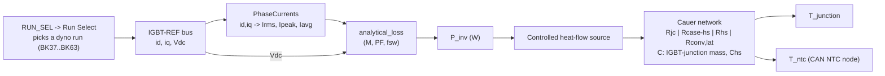

# ETM Simulink Model — Loss Model & Thermal Network (report)

> The two halves of the validated `MC_HS_ETM_I2.slx` electro-thermal model for the **T30 motor-controller heatsink + IGBT**: (A) the **electrical loss model** that turns a dyno operating point into inverter power loss `P_inv`, and (B) the **Simscape thermal network** that turns `P_inv` into node temperatures. This is the authoritative reference the 1D design tool was gated against.

---

## 1. Objective (from the project)
Build a **dyno-validated 1D electro-thermal (Cauer) model** of the IGBT + heatsink that predicts junction/NTC temperature from the electrical duty — matched to **11 dyno runs (356–492 W) to ~2 K** with a **single fitted parameter** `h = 29.59` (see [[T30_MC_ETM_Part1_Thermal_Budget]]). This report freezes *how the model is built* so it can be handed over and re-derived.

## 2. Model at a glance

---

## 3. Part A — the loss model

**Chain (left to right):**
1. **`RUN_SEL`** (here `8`) drives the **Run Select** multiport switch, choosing one dyno run's inputs (`BK37…BK63`) from the **Inputs** subsystem.
2. The selected run feeds the **IGBT-REF** bus: **`id`, `iq`** (dq-frame currents) and **`Vdc`** (DC-link voltage).
3. **`PhaseCurrents`** converts `id, iq` to the phase-current magnitudes — `Irms`, `Ipeak`, `Iavg`.
4. **`analytical_loss`** takes `Irms`, `Vdc`, and three operating constants — **Modulation `M = 0.86`**, **Power Factor `PF = 0.40`**, **Switching frequency `fsw = 10 kHz`** — and returns the loss split.

**Outputs at the snapshot shown (RUN_SEL = 8, a light-load point):**

| Quantity | Value (W) | Meaning |
|---|---|---|
| `Pcond_T` | 0.2864 | IGBT conduction loss (per device) |
| `Psw_T` | 0.3927 | IGBT switching loss (per device) |
| `Pcond_D` | 0.1639 | Diode conduction loss (per device) |
| `Psw_D` | 0.1096 | Diode reverse-recovery loss (per device) |
| `P_igbt` | 0.6791 | Total per IGBT (= Pcond_T + Psw_T) |
| `P_diode` | 0.2735 | Total per diode (= Pcond_D + Psw_D) |
| **`P_inv`** | **5.716** | Whole inverter = **6·P_igbt + 6·P_diode** |

**Sanity:** `6 × 0.6791 + 6 × 0.2735 = 5.716 W` — six IGBT + six diode in the three-phase bridge. RUN_SEL = 8 is a **light-load** point; the validated temperature runs go up to ~470–492 W.

`loss_from_idiq.m` mirrors this exact chain outside Simulink (same `M/PF/fsw`), reproducing model `P_inv` to **0.05 W**.

### Supportive theory — analytical inverter loss (SVPWM)
Per device, sinusoidal output, SVPWM. With peak phase current `Î`, duty set by `M`, load angle by `PF`:

With peak phase current `Î = √2·Irms` and `Mcos = M·PF` (verbatim from `analytical_loss.m`):

**IGBT conduction:** `Pcond_T = VCE0·Î·(1/2π + Mcos/8) + rC·Î²·(1/8 + Mcos/3π)`
**Diode conduction:** `Pcond_D = VF0·Î·(1/2π − Mcos/8) + rD·Î²·(1/8 − Mcos/3π)`
**IGBT switching:** `Psw_T = (fsw/π) · (Eon+Eoff) · (Vdc/Vref)^Kv · (Î/Iref)^Ki`
**Diode reverse recovery:** `Psw_D = (fsw/π) · Erec · (Vdc/Vref)^Kv · (Î/Iref)^Ki`

> Note the **`1/π`** on both switching terms (matches the model, not the textbook `fsw·E`). `Kv = Ki = 1`.

**FS200R07PE4 coefficients (datasheet rev 2.1, 150 °C set):**

| Coeff | Value | Coeff | Value |
|---|---|---|---|
| `VCE0` | 0.70 V | `Eon` | 4.05e-3 J |
| `rC` | 5.25e-3 Ω | `Eoff` | 11.0e-3 J |
| `VF0` | 0.70 V | `Erec` | 4.20e-3 J |
| `rD` | 3.75e-3 Ω | `Vref / Iref` | 300 V / 200 A |

The block sums each per-device loss; `P_inv = 6·(P_igbt + P_diode)`.

**`PhaseCurrents`:** `Ipeak = √(Id²+Iq²)`, `Irms = Ipeak/√2`, `Iavg = (2/π)·Ipeak` (amplitude-invariant dq).

---

## 4. Part B — the Simscape thermal network

`P_inv` drives a **controlled heat-flow source** into a **Cauer (physical) RC ladder** from junction to ambient:

| Element | Symbol | What it is | Value |
|---|---|---|---|
| Junction–case | `Rjc` | IGBT die to case (datasheet) | 0.02679 K/W |
| Case–heatsink | `Rcase-hs` | TIM / mounting interface | 0.00818 K/W |
| Heatsink | `Rhs` | conduction + spreading in the base | 0.03190 K/W |
| Convection | `Rconv,lat` | fins to air = `1/(h·A_fin)` | 0.1457 K/W |
| Junction mass | `C_j` | IGBT-junction thermal mass | CAD-derived |
| Heatsink mass | `C_hs` | `Chs` capacitor | CAD-derived |

- **Two temperature sensors:** `Junction Temp` (after `Rjc`) and `IGBT temp` / **NTC node** (the CAN-measured node the model is calibrated to).
- The **`f(x) = 0`** block is the Simscape solver configuration; the reference tank sets ambient.
- Time constants come from the **eigenvalues of the 2-node state matrix**, not per-branch RC products.

### Supportive theory — the network equations
Two coupled energy balances (junction/plate node `θ1`, heatsink node `θ2`), ambient reference `0`:

`C_j · dθ1/dt = Q − (θ1 − θ2)/R_series`
`C_hs · dθ2/dt = (θ1 − θ2)/R_series − θ2/R_conv`, with `R_series = Rcase-hs + Rhs`.

Junction adds the near-instant drop across `Rjc` (datasheet Foster τ ≤ 0.1 s, treated as resistive):
`T_junction = T_ntc_node + Q · Rjc`

At **steady state** all `d/dt → 0`, collapsing to `ΔT = Q · R` — but that holds **only** at steady state; the 4-min duty never reaches it, which is why the model is transient.

---

## 5. Worked example — the heatsink problem
Representative validated load: **Q = 470 W**, LM25 base, ambient **36 °C**, `h = 29.59`, `A_fin = 0.232 m²`, 240 s duty.

**Step 1 — convection resistance**
`Rconv,lat = 1/(h·A_fin) = 1/(29.59 × 0.232) = 1/6.865 = 0.1457 K/W`

**Step 2 — case-to-ambient resistance (NTC path)**
`Rtot = Rcase-hs + Rhs + Rconv,lat = 0.00818 + 0.03190 + 0.1457 = 0.1858 K/W`  (matches the tool readout)

**Step 3 — steady-state ceiling (if the duty never ended)**
`T_ntc,ss = T_amb + Q·Rtot = 36 + 470 × 0.1858 = 36 + 87.3 = 123.3 °C`  → far past the 95 °C NTC deration line.

**Step 4 — transient result at 240 s** (validated model, `τ2 ≈ 425 s`)
`T_ntc(240 s) = 80.88 °C`  — well under 95 °C. Storage (the `C` terms) absorbs the energy; the sink never reaches its ceiling in 4 minutes.

**Step 5 — junction temperature**
`T_junction = T_ntc + Q·Rjc = 80.88 + 470 × 0.02679 = 80.88 + 12.59 = 93.47 °C`  → under the **150 °C `Tvj,op`** limit.

**Lesson:** steady-state would blow the deration line (123 °C); the **4-minute transient** lands at 80.9 °C NTC / 93.5 °C junction. The design is **transient-limited**, and total thermal mass — not the node split — sets that margin.

---

## 6. Trust boundaries (read before quoting numbers)
- **`T_junction` is ESTIMATED, not measured** — `= T_sim + Q·RthJC`, `RthJC = 0.02679` (datasheet, 6 IGBT ∥ 6 diode). No junction validation data.
- Only **`T_mes` (the CAN NTC)** is measured; `T_sim` is calibrated to it (model reads ~2 K low → conservative).
- **Two known biases on `T_junction`:**
  - reads **HIGH** — the NTC sits on the DCB, already partway up `RthJC`, so adding the full value double-counts part of the rise;
  - reads **LOW at high load** — `0.02679` assumes IGBT/diode loss split by conductance; IGBT-only would be **0.04167 (+56 %)**. **Use `0.04167` for any safety claim.**
- **Limit is `Tvj,op = 150 °C`**, NOT the 95 °C line (that is NTC deration).
- **`h` is the only fitted parameter** and is **not predictive for a redesigned fin geometry** — that needs CFD or test.

## 7. Files (reference)
- Model: `MC_HS_ETM_I2.slx` (authoritative, slow)
- Loss chain: `PhaseCurrents`, `analytical_loss`, `loss_from_idiq.m`
- Fast twin + tool: `mc_thermal_app.m`, `thermal_core.m` (see `README_thermal_tool.md`)
- Images: `MC_ETM_Loss_Model.png`, `MC_ETM_Thermal_Network.png` (this folder)

---

### Key identifiers
`MC_HS_ETM_I2.slx` · `analytical_loss` · `PhaseCurrents` · `RUN_SEL` · `P_inv = 6·P_igbt + 6·P_diode` · `Rjc 0.02679` · `Rhs 0.03190` · `Rconv 0.1457` · `Rtot 0.1858` · `Tj 93.5 C @ 470 W / 240 s` · `transient-limited` · `use 0.04167 for safety`
