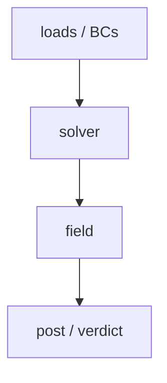

<%*
// CAE/CFD preset — 6-section kickoff with the simulation spine pre-filled (sections 4 & 5).
-%>
---
tags: [<domain>, project, CAE]
aliases: []
status: active
project: <% tp.file.folder() %>
created: <% tp.date.now("YYYY-MM-DD") %>
related: []
---

# <% tp.file.folder() %> — Problem Statement

> [!abstract] One-line objective
> <the deliverable in a single sentence>

## 1. Objective
- **Deliverable:** · **Consumer/decision:** · **Success criterion:** · **Scope:** ✅ … ⛔ … · **Risks:**

## 2. Methodology

- **Phase N — <name>** · gate: <mesh converged / singularity ruled out / validated>

## 3. Software & Environment
- Solver(s) + version · custom scripts + paths · hardware · launch quirks · file locations

## 4. Calc & Theory  *(CAE spine — each item links its Ideaverse page; backfill if missing)*
- **Governing equations:** <Navier–Stokes + turbulence model | heat equation | linear elasticity> → [[ ]]
- **Material properties + validity window:** <temperature-dependent? constant OK?> → [[ ]]
- **Boundary conditions + justification:** <why this constraint, why this load path>
- **Assumptions + invalidation triggers:** steady vs transient · linear vs nonlinear · Tg · yield

## 5. End Result & how it's studied  *(CAE verification checklist — link each to concepts/ or gotchas/)*
- [ ] **Mesh independence** — result converged, not mesh-sensitive
- [ ] **Singularity vs real concentration** at every hotspot → [[Stress_Singularity_vs_Concentration]]
- [ ] **Physical-location sanity** — peak where physics predicts, not at a constraint artifact
- [ ] **Magnitude sanity** — plausible for material / regime
- [ ] **Validation against known** — benchmark / test / analytical / prior run
- [ ] **Unit & data-transfer sanity** — coordinate + field magnitudes survive every tool handoff → [[Unit_Mismatch_in_CAE_Data_Transfer]]

## 6. End Result For
- Consumer + format · absolute vs comparative honesty · next action unblocked

## Key identifiers
`<project>` · `CAE` · `<solver>` · `<key terms>`
