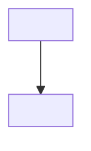

# Project Note Set — what `/start` creates

Every project gets **one folder** under `03 Projects/<Project-Name>/` containing:

| File | Purpose | Seed from |
|---|---|---|
| `00 Home.md` | dashboard anchor: frontmatter (`objective`, `current_phase`) + phase **roadmap** (milestones the dashboard reads) | `_templates/Project/00 Home.md` |
| `<Project>_Problem_Statement.md` | the 6-section kickoff | `Universal_Project_Workflow_Template` (or `CAE_CFD_Project_Preset`) |
| `<Project>_Progress_Log.md` | chronological: tried → broke → root cause → fix; generalisable root causes flagged `#learning` | skeleton below |
| `<Project>_Flowchart.md` | how the process/tool works — mermaid only | skeleton below |
| `<Project>_Approach_and_TODO.md` | forward work, priority-ordered, method/theory per upcoming phase (links concept pages) | skeleton below |
| `daily/` | folder for `EOD_<date>_<Project>_<phase>.md` | — |

---

## `<Project>_Progress_Log.md` skeleton
```markdown
---
tags: [<domain>, progress-log]
status: active
project: <Project>
related: []
---
# <Project> — Progress Log
> Chronological. What was tried, what broke, root cause, the fix. Generalisable root cause → tag `#learning`.

## <YYYY-MM-DD>
- **Tried:** · **Broke:** · **Root cause:** · **Fix:**

## Key identifiers
```

## `<Project>_Flowchart.md` skeleton
```markdown
---
tags: [<domain>, flowchart, architecture]
status: active
project: <Project>
related: []
---
# <Project> — How it works

## Key identifiers
```

## `<Project>_Approach_and_TODO.md` skeleton
```markdown
---
tags: [<domain>, TODO, roadmap]
status: active
project: <Project>
related: []
---
# <Project> — Approach & TODO
> Forward work, priority-ordered. Method/theory for upcoming phases, linked to [[concept pages]].

## Next step
## Upcoming phases (method + theory)
## Open decisions / needs data

## Key identifiers
```
