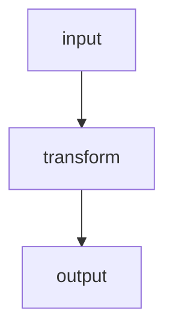

<%*
// Universal 6-section kickoff — drives <Project>_Problem_Statement.md
// Insert into a new project's Problem_Statement note.
-%>
---
tags: [<domain>, project]
aliases: []
status: active
project: <% tp.file.folder() %>
created: <% tp.date.now("YYYY-MM-DD") %>
related: []
---

# <% tp.file.folder() %> — Problem Statement

> [!abstract] One-line objective
> <the deliverable in a single sentence>

## 1. Objective
- **Deliverable:** <one line>
- **Consumer / decision it feeds:** <who, what call it unblocks>
- **Success criterion:** <how we know it's done / good>
- **Scope boundary:** ✅ in scope … · ⛔ deferred …
- **Risks to the result:** <what could make the number wrong>

## 2. Methodology
Input → transform → output chain, divided into verifiable **phases with gates**.

- **Phase 1 — <name>** · gate: <what must pass before advancing>
- **Phase 2 — <name>** · gate: …

## 3. Software & Environment
- Solvers / tools:
- Custom scripts + paths:
- Hardware:
- Launch quirks / file locations:

## 4. Calc & Theory
> **Start from the Ideaverse.** List the concept pages this relies on first; mark anything missing `#learning` for harvest.

- Ideaverse concepts used: [[ ]]
- Governing relations:
- Assumptions + validity window:
- Invalidation triggers:
- Data needed:
- References: [[ ]]

## 5. End Result & how it's studied
- Primary quantity:
- Where read (step / scope / location):
- **Verification gate(s):** <check that must pass — link `gotchas/` where relevant>
- Sensitivity / error drivers:

## 6. End Result For
- Consumer + format:
- Absolute vs comparative honesty:
- Next action unblocked:

## Key identifiers
`<project>` · `<key terms for search>`
